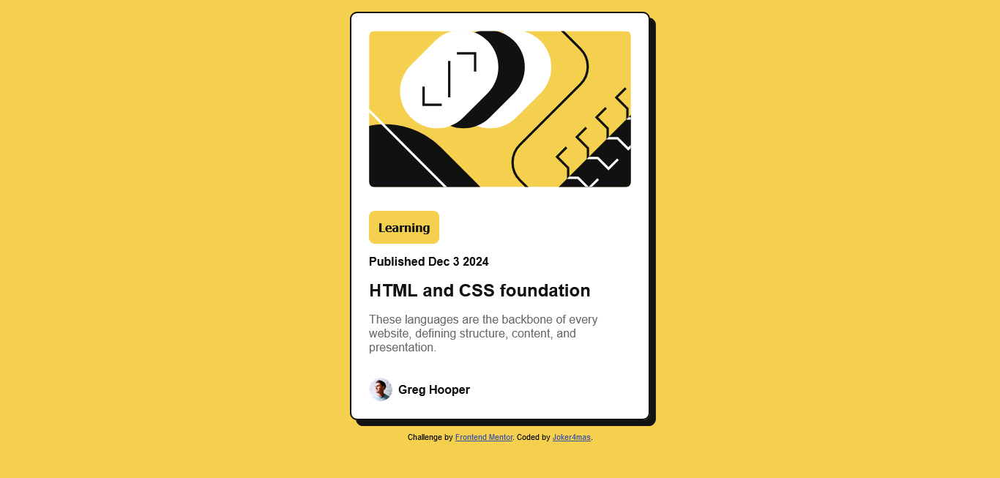

# Frontend Mentor - Blog preview card solution

This is a solution to the [Blog preview card challenge on Frontend Mentor](https://www.frontendmentor.io/challenges/blog-preview-card-ckPaj01IcS). Frontend Mentor challenges help you improve your coding skills by building realistic projects. 

## Table of contents

- [Frontend Mentor - Blog preview card solution](#frontend-mentor---blog-preview-card-solution)
  - [Table of contents](#table-of-contents)
  - [Overview](#overview)
    - [The challenge](#the-challenge)
    - [Screenshot](#screenshot)
    - [Links](#links)
  - [My process](#my-process)
    - [Built with](#built-with)
    - [What I learned](#what-i-learned)
    - [Continued development](#continued-development)
    - [Useful resources](#useful-resources)
  - [Author](#author)

**Note: Delete this note and update the table of contents based on what sections you keep.**

## Overview

### The challenge

Users should be able to:

- See hover and focus states for all interactive elements on the page

### Screenshot



### Links

- Solution URL:(https://github.com/Joker4mas/blog-card-preview-FE.git)
- Live Site URL:(https://blogcard-jk.netlify.app/)

## My process

### Built with

- Semantic HTML5 markup
- CSS custom properties
- Flexbox
- Mobile-first workflow

### What I learned

I learnt how to use custom colors using psuedo-code, font properties, flex box, box-shadows etc .

To see how you can add code snippets, see below:

```html
<h1>HTML and CSS foundation</h1>
```
```css
.proud-of-this-css {
  box-shadow: 1.5rem;
}
```


### Continued development

I earger to continue learnig more about Css properties such as variables, custom fonts and more HTML5 semantics for SEO eligibility.

### Useful resources

- [Example resource 1](https://www.w3schools.com) - This helped me for styling the box-shadow. I really liked this pattern and simple way they implemented the style for easy learning. I will use it going forward.

## Author

- Frontend Mentor - [@Joker4mas](https://www.frontendmentor.io/profile/@Joker4mas)
- Twitter - [@Joker4mas](https://www.twitter.com/Joker4mas)
